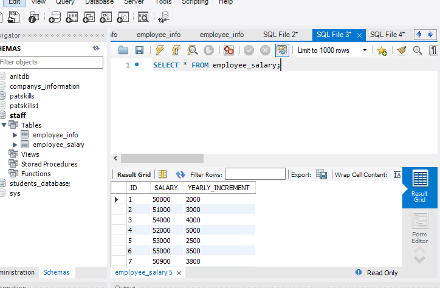
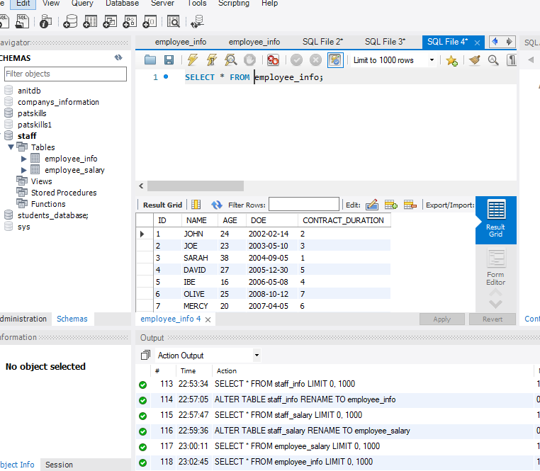

# SQL-TASK2
## PROBLEM STATEMENT
- Rename the previous name EMPLOYEE_INFO and EMPLOYEE_SALARY respectively

- Change the ID COLUMN to EMPLOYEE_ID on both columns

.PNG)

- Create new column in the EMPLOYEE_SALARY table named DEPARTMENT

.PNG)

-For employees with the following IDs (1, 3, 7), IT
 IDs (2,5,9) ADVERTISING
 IDs (4,6,8,10) COMMUNICATIONS

 .PNG)

Change the DATA_TYPE of the IDs in both tables 

-Run a query to return the YEAR, MONTH and DAY each employee came into the company

.PNG)

.PNG)

!

-Run a query to add 10 years to the year employees came into the company as YEAR_OF_EXIT

.PNG)

-U

 

