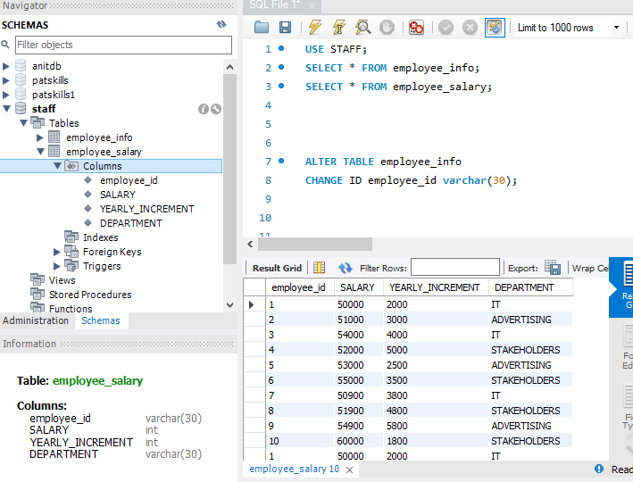

# SQL-TASK2
## UPDATING AND MODIFYING DATA IN SQL
## PROBLEM STATEMENT
### Rename the previous table from STAFF_INFO TO EMPLOYEE_INFO 
### Also the previous table STAFF_SALARY TO EMPLOYEE_SALARY 

### Rename the existing COLUMN ID to "EMPLOYEE_ID" on both columns

.PNG)

### Create new column in the EMPLOYEE_SALARY table named "DEPARTMENT".

.PNG)

### Update data with the table, ie For employees, with the following:
 IDs (1, 3, 7), IT
 IDs (2, 5, 9) ADVERTISING
 IDs (4, 6, 8, 10) COMMUNICATIONS

 .PNG)

### Change the DATA_TYPE of the IDs in both tables to TEXT DATATYPE

### Run a query to return the DAY, MONTH and YEAR each employee came into the company

.PNG)

.PNG)

.PNG)

### Run a query to add 10 years to the year employees came into the company as "YEAR_OF_EXIT"

.PNG)

### update the employee_info table with the new column "YEAR_OF_EXIT"

## CONCLUSION
### The task shows the basic commands in MYSQL used to modify and update data

 

